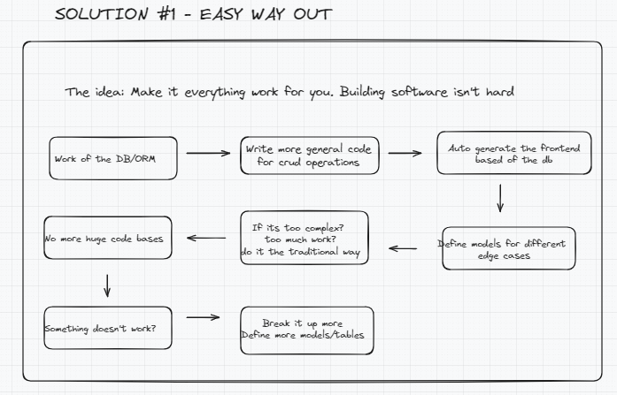
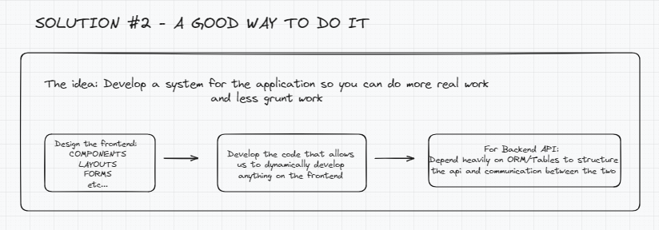
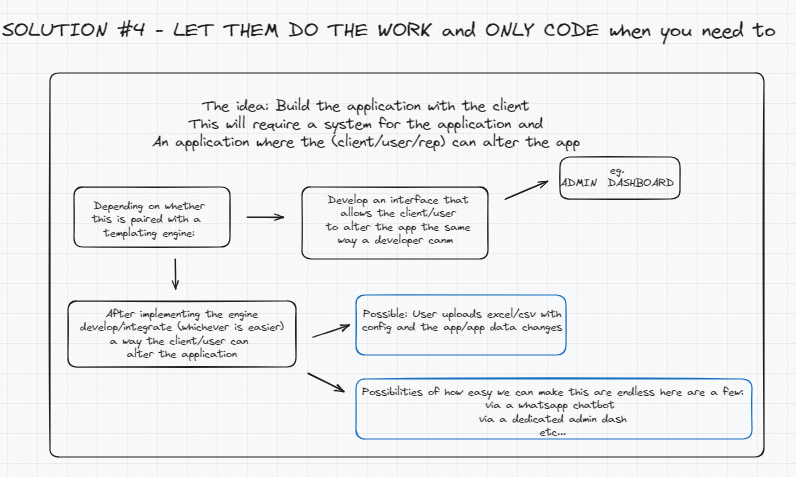

# DO THE WORK or DO THE WORK!

> This is not just an idea; it's a mindset shift. "Do the work" - how sure are you that you're not doing grunt work and calling it work? Or DO THE WORK! - do it right so you don't have to repeat yourself.

> The following guide provides a framework for implementing these principles through a demo application: a TODO List App.

# TABLE OF CONTENTS
1. WHY (#why)
2. Make things work for you (#solution1)
3. Develop a templating engine (#solution2)
4. Develop the app with the user (#solution3)

## 1. WHY

The traditional way of development requires you to follow a step-by-step guide, often leading to redundant, boring, or tedious tasks. This approach can make development feel monotonous and uninspiring.

The following illustration provides more context:

## 2. HACK: Make things work for you

Leverage your resourcefulness as a developer: define your database and models so precisely that you no longer have to rewrite forms and layouts. This ensures efficiency and consistency in your workflow.

## 3. Develop a templating engine for your application

Create a templating engine to streamline the development process. This method provides a more structured and reliable way to build software, enhancing maintainability and scalability.

## 4. Let the client/user do the work and you only if YOU NEED TO

Empower your clients to make changes and customize the application easily. This approach minimizes your workload while maximizing the application's adaptability to user needs.

